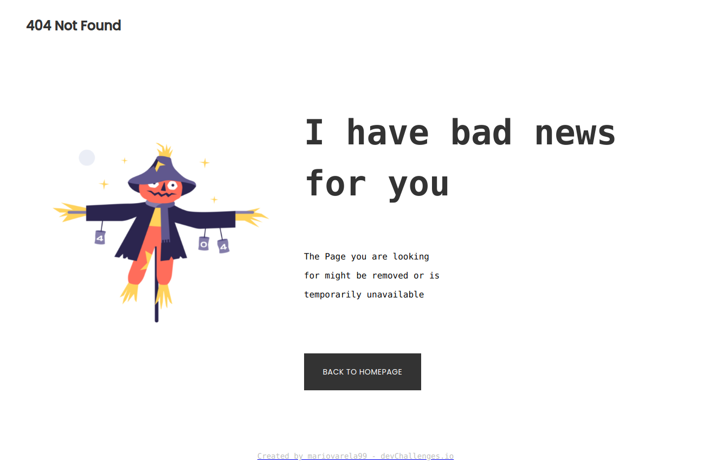

<!-- Please update value in the {}  -->

<h1 align="center"> 404_DevChallenge </h1>

   Solution for a challenge from  <a href="http://devchallenges.io" target="_blank">Devchallenges.io</a>.

  <h3>
    <a href="https://mariovarela99.github.io/404_challenge/">
      Demo
    </a>
     | 
    <a href="https://{your-url-to-the-solution}">
      Solution
    </a>
     | 
    <a href="https://devchallenges.io/challenges/wBunSb7FPrIepJZAg0sY">
      Challenge
    </a>
  </h3>

## Overview

### Built With

- HTML
- Sass

## Contact

- Website [mariovarela99.com](https://{mariovarela99/me.io})
- GitHub [@mariovarela99](https://{github.com/mariovarela99})
- Twitter [@MarioVarela4](https://{twitter.com/mariovarela4})
